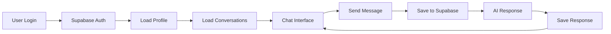

# 🔐 Authenticated User Experience Flow

## Overview
Complete UX flow for users who sign up/login with email/password or OAuth providers (GitHub, Google, etc.)

---

## 📱 Initial App Access

### Step 1: Landing Page (/)
- ✅ User visits root URL
- ✅ App checks Supabase authentication status
- ✅ If authenticated → redirect to `/chat`
- ✅ If not authenticated → redirect to `/login`

### Step 2: Login Page (/login)
- ✅ Email/password login form
- ✅ OAuth buttons (GitHub, Google, etc.)
- ✅ Sign up option available
- ✅ "Continue as Guest" option available (for comparison)

---

## 🔑 Authentication Process

### Email/Password Login
- ✅ User enters email and password
- ✅ Supabase validates credentials
- ✅ On success → redirect to `/chat`
- ✅ On failure → show error message

### OAuth Login (GitHub/Google)
- ✅ User clicks OAuth provider button
- ✅ Redirects to provider's authorization page
- ✅ User authorizes the app
- ✅ Redirects back via `/auth/callback`
- ✅ Supabase processes OAuth tokens
- ✅ Final redirect to `/chat`

### Sign Up Process
- ✅ User enters email, password, confirm password
- ✅ Supabase creates account
- ✅ Email confirmation sent
- ✅ User clicks confirmation link
- ✅ Account activated → redirect to `/chat`

---

## 💬 Chat Experience

### First Time Setup
- ✅ User lands on `/chat` page
- ✅ ChatContext initializes and loads:
  - ✅ User profile from Supabase
  - ✅ Conversations from Supabase database
  - ✅ User authentication status
- ✅ If no OpenRouter API key → shows onboarding modal
- ✅ User can click "Go to Settings" or "Later"

### Chat Interface
- ✅ Left sidebar with conversation history
- ✅ Main chat area with message history
- ✅ Chat input with model selector
- ✅ All conversations loaded from Supabase database
- ✅ Real-time message streaming
- ✅ File attachment support
- ✅ Consensus mode available

---

## 🗨️ Conversation Management

### Creating New Conversations
- ✅ Click "New Chat" button
- ✅ Start typing message
- ✅ First message creates conversation in Supabase
- ✅ Auto-generated title from AI
- ✅ Conversation appears in sidebar immediately

### Existing Conversations
- ✅ All conversations loaded from Supabase on app start
- ✅ Click conversation in sidebar → loads messages from database
- ✅ URL updates to `/chat/[conversation-id]`
- ✅ Message history preserved across sessions
- ✅ Real-time updates when new messages arrive

### Conversation Actions
- ✅ Delete conversations (removes from Supabase)
- ✅ Rename conversations (updates in Supabase)
- ✅ Share conversations (if implemented)

---

## 🤖 AI Features

### Model Selection
- ✅ Access to all OpenRouter models
- ✅ Model capabilities displayed
- ✅ File upload support based on model
- ✅ Consensus mode with multiple models

### Message Features
- ✅ Real-time streaming responses
- ✅ Markdown rendering
- ✅ Code syntax highlighting
- ✅ File attachments (images, documents)
- ✅ Message editing/regeneration

### Consensus Mode
- ✅ Select multiple AI models
- ✅ Get responses from all selected models
- ✅ Compare different AI perspectives
- ✅ All responses saved to database

---

## ⚙️ Settings Management

### Profile Settings
- ✅ Access via sidebar settings button → `/settings`
- ✅ View/edit profile information
- ✅ Manage account preferences
- ✅ All settings stored in Supabase profile

### API Key Management
- ✅ Enter/update OpenRouter API key
- ✅ Key stored in Supabase user profile
- ✅ Secure encryption of API keys
- ✅ Validation of API key functionality

### Account Management
- ✅ Change password
- ✅ Update email address
- ✅ Delete account option
- ✅ Sign out functionality

---

## 🔄 Session Management

### Persistence
- ✅ All data stored in Supabase cloud database
- ✅ Conversations sync across devices
- ✅ Settings preserved across sessions
- ✅ Automatic session refresh

### Logout Process
- ✅ Click "Sign Out" in settings
- ✅ Supabase auth session cleared
- ✅ Redirect to `/login`
- ✅ Local state cleared
- ✅ All data remains in cloud database

### Re-login
- ✅ User logs back in
- ✅ All conversations and settings restored
- ✅ No data loss
- ✅ Seamless experience continuation

---

## 🛡️ Data Security & Sync

### Cloud Storage
- ✅ All conversations stored in Supabase
- ✅ Real-time database updates
- ✅ Cross-device synchronization
- ✅ Automatic backups

### Privacy & Security
- ✅ User data isolated by user ID
- ✅ Secure API key storage
- ✅ HTTPS encryption
- ✅ No data mixing between users

---

## 🎯 Feature Checklist

### Core Features
- ✅ Multi-model AI chat
- ✅ Real-time streaming
- ✅ File attachments
- ✅ Conversation history
- ✅ Message search
- ✅ Export conversations

### Advanced Features
- ✅ Consensus mode
- ✅ Custom model parameters
- ✅ Conversation sharing
- ✅ API key management
- ✅ Profile customization
- ✅ Cross-device sync

### Technical Features
- ✅ Optimistic UI updates
- ✅ Error handling
- ✅ Offline detection
- ✅ Performance optimization
- ✅ TypeScript safety
- ✅ Responsive design

---

## 📊 Data Flow Summary

**Total Experience: Premium cloud-based chat with full synchronization and advanced features** ⭐
